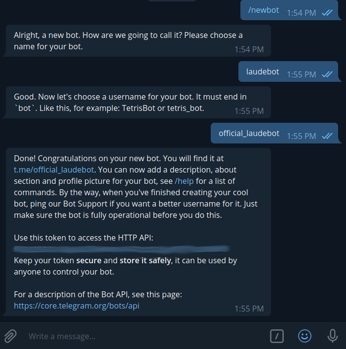
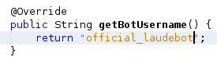
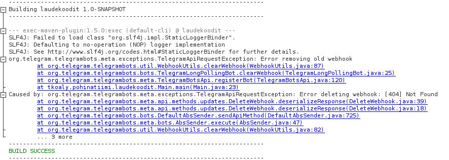

# Example bot and guide

## Prerequisites

  - Telegram account
  - Some knowledge of git

## Creating your first bot

1. Fork or clone this repository
2. Go to https://telegram.me/BotFather
3. Send message '/newbot'
4. Follow instructions

Your conversation should look something like this

**Copy the blurred line of text from your conversation, it is called a token and is vital for the next step**

## Connecting code to the bot

**If you haven't already now is the time to fork or clone this repository.**

Next we need to connect the code in this repository to the bot we just created.

1. Create a file called '.env' inside project root directory*
2. Inside .env write 'BOT_TOKEN=[INSERT TOKEN YOU COPIED HERE]' without the [] brackets

*Root directory is the same directory with pom.xml, README.md etc.

Well done! We are almost finished.

3. Open up Laudebot.java
4. Within the getBotUsername -method insert your bots username

If your bots name is offical_laudebot the method should look like this

**Congratulation your bot is now finished. Run the code and test it out**

### More information

Next you probably want start hacking and hustling on your teams bot. I've heavily commented Laubebot.java so you can use it as starting point for your own. For more detailed informatio visit https://github.com/rubenlagus/TelegramBots/wiki 

You can also ask for help from out telegram-channel at: https://t.me/laudekoodit

### Errors

If you get an error like below it means your token is not setup right.

